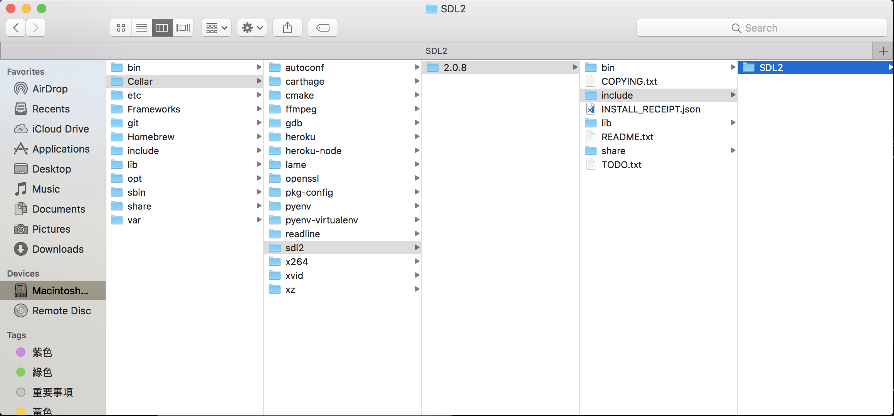
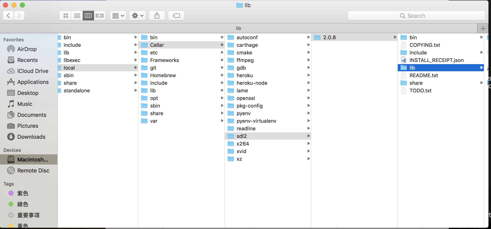
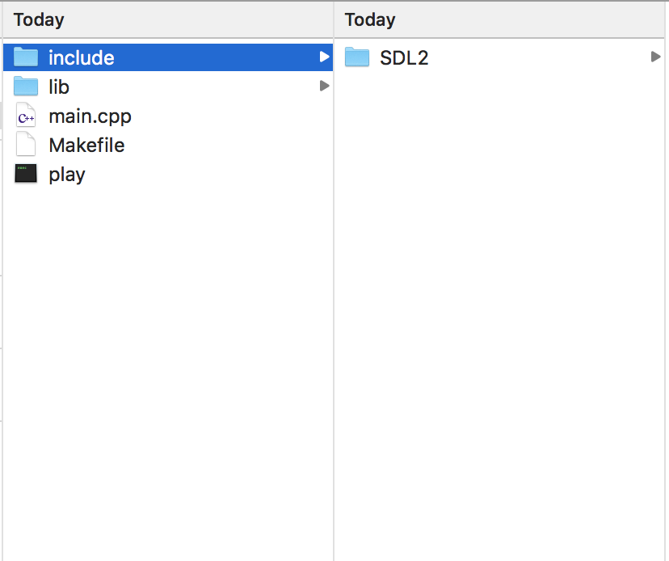
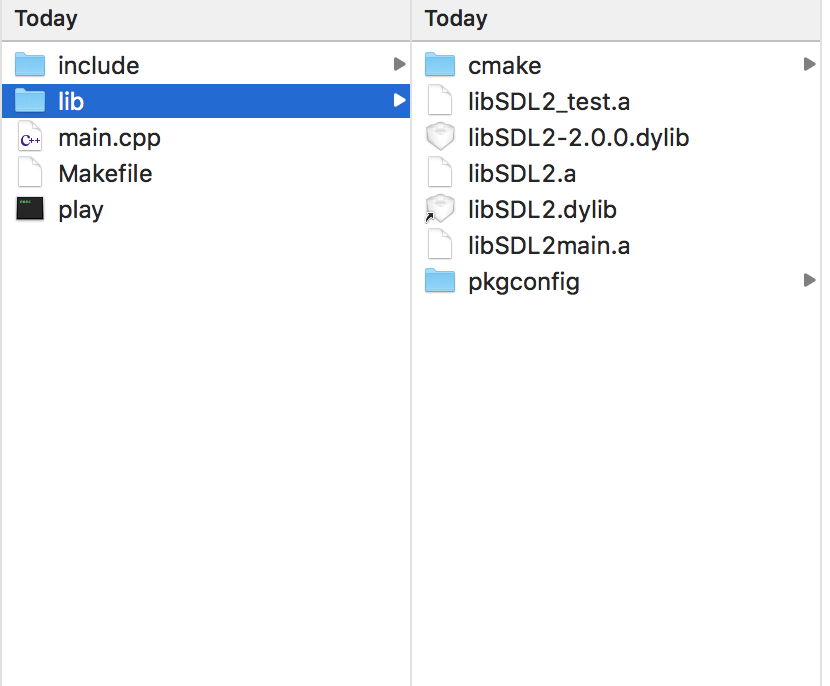

# SDL 開發環境設置   
SDL，全名Simple DirectMedia Layer， 是一套跨平台多媒體開發函式庫，由C語言寫成，他提供了各種控制圖像、聲音、基本IO的function給大家使用。因此我們這次遊戲的主要架構會建構在SDL C++這個框架上。我們使用的SDL版本是2.0.8 .

接下來就是設置的步驟.
Mac 請看：[Mac](#mac)


## <a name="mac">For Mac Users</a>
這次主要會在終端機(Terminal)做操作。
### Step 1
#### Step 1.1 安裝Xcode & homebrew
請先到App Store 安裝XCode，檔案有點大，會需要一段時間。   
Xcode ?  
> 在mac上做開發的一個IDE（像是dev c++也是ide)，可以開發iphone或mac上的應用程式，他文字編輯器、編譯器等等的都有包含，不過我們這次只是利用他來建立你c++編譯器(g++)   

[homebrew](https://brew.sh/index_zh-tw.html) ?
> 簡單來說，他是一個套件管理軟體，而套件就是人家寫好的一些可以用的程式。所以你可以用homebrew安裝一些你會用到的而且別人寫好的code(省時間呀～)，或者更新那個套件等等。      

在安裝完Xcode後，開啟Xcode同意授權，等Xcode授權完畢且開啟完成後，開啟 終端機(在 finder 點 /應用程式/工具程式/終端機） 之後，輸入並執行(按Enter):      
  `/usr/bin/ruby -e "$(curl -fsSL https://raw.githubusercontent.com/Homebrew/install/master/install)"`      

#### Step 1.2 安裝sdl2
打開終端機，執行：  `brew install sdl2`     
brew(也就是homebrew)就會去找編譯好的sdl2 函數庫，下載到你的電腦上。  

可以執行`ls /usr/local/Cellar/`(ls是一個指令，叫終端機list出 /usr/local/Cellar/ 這個資料夾有什麼東西) **會出現一個`sdl2`項目**   

### Step 2 創建new project
繼續在終端機上面執行以下指令（直接複製貼上也可以）：
```
cd Desktop # cd -> change directory, 更換現在的目錄到Desktop， 也就是說接下來增加的檔案夾會在Desktop裡
mkdir myproject # mkdir -> make directory, 建立資料夾， 叫做 "myproject" , 可以把myproject改成自己設定的名字
cd myproject # cd -> change directory, 更換現在的目錄到myproject
touch main.cpp # touch -> 建立新的檔案，main.cpp是檔案名稱。 因為前一個指令，所以在這行指令後，myproject這個directory會有一個檔案叫做main.cpp
touch Makefile
mkdir include
mkdir lib
open .
```  
打開編輯/myproject/main.cpp：  

```   

/*This source code copyrighted by Lazy Foo' Productions (2004-2015)
 and may not be redistributed without written permission.*/

//Using SDL and standard IO
#include <SDL2/SDL.h>
#include <stdio.h>

//Screen dimension constants
const int SCREEN_WIDTH = 640;
const int SCREEN_HEIGHT = 480;

int main( int argc, char* args[] )
{
    //The window we'll be rendering to
    SDL_Window* window = NULL;

    //The surface contained by the window
    SDL_Surface* screenSurface = NULL;

    //Initialize SDL
    if( SDL_Init( SDL_INIT_VIDEO ) < 0 )
    {
        printf( "SDL could not initialize! SDL_Error: %s\n", SDL_GetError() );
    }
    else
    {
        printf("jj");
        //Create window
        window = SDL_CreateWindow( "SDL Tutorial", SDL_WINDOWPOS_UNDEFINED, SDL_WINDOWPOS_UNDEFINED, SCREEN_WIDTH, SCREEN_HEIGHT, SDL_WINDOW_SHOWN );
        if( window == NULL )
        {
            printf( "Window could not be created! SDL_Error: %s\n", SDL_GetError() );
        }
        else
        {
            //Get window surface
            screenSurface = SDL_GetWindowSurface( window );

            //Fill the surface white
            SDL_FillRect( screenSurface, NULL, SDL_MapRGB( screenSurface->format, 0xFF, 0xFF, 0xFF ) );

            //Update the surface
            SDL_UpdateWindowSurface( window );

            //Wait two seconds
            SDL_Delay( 3000 );
        }
    }

    //Destroy window
    SDL_DestroyWindow( window );

    //Quit SDL subsystems
    SDL_Quit();

    return 0;
}

```   

### Step 3 將SDL 檔案 加入這個project
方便起見，在終端機執行：`open /usr/local/Cellar/sdl2`  
把最右邊的SDL2檔案夾 **複製** 到剛剛建立的myproject/include 裡面    

   

把最右邊的lib檔案夾內的東西 **複製** 到剛剛建立的myproject/lib 裡面    



所以myproject 這個資料夾有：  

   



接著， 編輯 Makefile:

```  
game:
  g++ main.cpp -o play -I include -L lib -l SDL2-2.0.0
```  
g前面是'tab'    


最後，在終端機執行：   
`make game`  
這個指令會根據makefile編譯你的program。     
編譯完成，會有一個叫做play的執行檔可以執行    
接著run 整個program:    
`./play`    
如果有一個白色的視窗跑出來兩秒，就大功告成了~~~~


---
## <a name="win">For Window Users</a>

For Window Users
