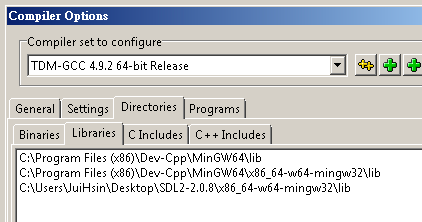

# SDL 開發環境設置   
SDL，全名Simple DirectMedia Layer， 是一套跨平台多媒體開發函式庫，由C語言寫成，他提供了各種控制圖像、聲音、基本IO的function給大家使用。因此我們這次遊戲的主要架構會建構在SDL C++這個框架上。我們使用的SDL版本是2.0.8 .

接下來就是設置的步驟.
Mac 請看：[Mac](#mac)


## <a name="mac">For Mac Users</a>
部分步驟如有困難，可以參考以下影片  


這次主要會在終端機(Terminal)做操作。
### Step 1
#### Step 1.1 安裝Xcode
請先到App Store 安裝XCode，檔案有點大，會需要一段時間。   
Xcode ?  
> 在mac上做開發的一個IDE（像是dev c++也是ide)，可以開發iphone或mac上的應用程式，他文字編輯器、編譯器等等的都有包含，不過我們這次只是利用他來建立你c++編譯器(g++)   


#### Step 1.2 安裝sdl2
到[這裡](https://www.libsdl.org/download-2.0.php) ，下載`Development Libraries:`底下：`SDL2-2.0.8.dmg`  
點擊兩下後， 將`SDL2.framework`拉進去`Library/Frameworks`

### Step 2 創建new project
繼續在終端機上面執行以下指令（直接複製貼上也可以）：
```
cd Desktop # cd -> change directory, 更換現在的目錄到Desktop， 也就是說接下來增加的檔案夾會在Desktop裡
mkdir myproject # mkdir -> make directory, 建立資料夾， 叫做 "myproject" , 可以把myproject改成自己設定的名字
cd myproject # cd -> change directory, 更換現在的目錄到myproject
touch main.cpp # touch -> 建立新的檔案，main.cpp是檔案名稱。 因為前一個指令，所以在這行指令後，myproject這個directory會有一個檔案叫做main.cpp
touch Makefile
mkdir include
mkdir lib
open .
```  
打開編輯/myproject/main.cpp：  

```   

/*This source code copyrighted by Lazy Foo' Productions (2004-2015)
 and may not be redistributed without written permission.*/

//Using SDL and standard IO
#include <SDL2/SDL.h>
#include <stdio.h>

//Screen dimension constants
const int SCREEN_WIDTH = 640;
const int SCREEN_HEIGHT = 480;

int main( int argc, char* args[] )
{
    //The window we'll be rendering to
    SDL_Window* window = NULL;

    //The surface contained by the window
    SDL_Surface* screenSurface = NULL;

    //Initialize SDL
    if( SDL_Init( SDL_INIT_VIDEO ) < 0 )
    {
        printf( "SDL could not initialize! SDL_Error: %s\n", SDL_GetError() );
    }
    else
    {
        printf("jj");
        //Create window
        window = SDL_CreateWindow( "SDL Tutorial", SDL_WINDOWPOS_UNDEFINED, SDL_WINDOWPOS_UNDEFINED, SCREEN_WIDTH, SCREEN_HEIGHT, SDL_WINDOW_SHOWN );
        if( window == NULL )
        {
            printf( "Window could not be created! SDL_Error: %s\n", SDL_GetError() );
        }
        else
        {
            //Get window surface
            screenSurface = SDL_GetWindowSurface( window );

            //Fill the surface white
            SDL_FillRect( screenSurface, NULL, SDL_MapRGB( screenSurface->format, 0xFF, 0xFF, 0xFF ) );

            //Update the surface
            SDL_UpdateWindowSurface( window );

            //Wait two seconds
            SDL_Delay( 3000 );
        }
    }

    //Destroy window
    SDL_DestroyWindow( window );

    //Quit SDL subsystems
    SDL_Quit();

    return 0;
}

```   


接著， 編輯 Makefile:

```  
game:
  g++ main.cpp -o play -I include -L lib -l SDL2-2.0.0
```  
g前面是'tab'    


最後，在終端機執行：   
`make game`  
這個指令會根據makefile編譯你的program。     
編譯完成，會有一個叫做play的執行檔可以執行    
接著run 整個program:    
`./play`    
如果有一個白色的視窗跑出來兩秒，就大功告成了~~~~


---
## <a name="win">For Window Users</a>

For Window Users
部分步驟如有困難，可以參考以下影片    
  

### Step 1
假設已安裝Dev C++
#### Step 1.1 下載SDL2
請點[此網址](https://www.libsdl.org/download-2.0.php)，下載 **Development Libraries:** 底下 **SDL2-devel-2.0.8-mingw.tar.gz (MinGW 32/64-bit)**，並解壓縮。


#### Step 1.2 在dev c++ 設定
打開Dev C++，按`工具（T）/編譯器選項（E）`


到`目錄（Directories`)的`C++印入檔（C++ includes)`點擊`開啟`（藍色框框裡的)


從剛剛下載並解壓縮後的資料夾(SDL2-2.0.8)，
選擇其中的`x86_64-w64-mingw32`的 **`include`** 資料夾，如下圖。


按確定後，再按`新增(Add)`

出現：


再重複類似的動作，到`程式庫(Libraries)`，開啟`x86_64-w64-mingw32`的 **`lib`** 資料夾，按確定。


最後出現



### Step 2 創建new project
#### Step2.1 include sdl2
複製`SDL2-2.0.8/x86_64-w64-mingw32/bin`裡的`SDL2.dll`到你即將建立的專案資料夾


### Step 2.2
按`檔案(File)/開啟新檔(New File)/專案(Project)`，選"Empty Project"


到`專案Project/專案選項(project options)`，選擇`General(一般)`，點選 **`Win32 GUI`**(這樣跑的時候，console 不會跳出來)，


接著選擇`參數(Parameters)/`，在Linker輸入（如下圖):
```
-lmingw32
-lSDL2main
-lSDL2
```


#### Step 2.3 main.cpp
增加一個cpp檔案，並貼上以下程式碼:
  

```C++

//Using SDL and standard IO
//----------------------
#include "SDL2/SDL.h"
//-----------------------
#include <stdio.h>

//Screen dimension constants
const int SCREEN_WIDTH = 640;
const int SCREEN_HEIGHT = 480;

int main( int argc, char* args[] )
{
    //The window we'll be rendering to
    SDL_Window* window = NULL;

    //The surface contained by the window
    SDL_Surface* screenSurface = NULL;

    //Initialize SDL
    if( SDL_Init( SDL_INIT_VIDEO ) < 0 )
    {
        printf( "SDL could not initialize! SDL_Error: %s\n", SDL_GetError() );
    }
    else
    {
        printf("jj");
        //Create window
        window = SDL_CreateWindow( "SDL Tutorial", SDL_WINDOWPOS_UNDEFINED, SDL_WINDOWPOS_UNDEFINED, SCREEN_WIDTH, SCREEN_HEIGHT, SDL_WINDOW_SHOWN );
        if( window == NULL )
        {
            printf( "Window could not be created! SDL_Error: %s\n", SDL_GetError() );
        }
        else
        {
            //Get window surface
            screenSurface = SDL_GetWindowSurface( window );

            //Fill the surface white
            SDL_FillRect( screenSurface, NULL, SDL_MapRGB( screenSurface->format, 0xFF, 0xFF, 0xFF ) );

            //Update the surface
            SDL_UpdateWindowSurface( window );

            //Wait two seconds
            SDL_Delay( 3000 );
        }
    }

    //Destroy window
    SDL_DestroyWindow( window );

    //Quit SDL subsystems
    SDL_Quit();

    return 0;
}


```


接著編譯、執行整個project:
如果有一個白色的視窗跑出來兩秒，就大功告成了~~~~
